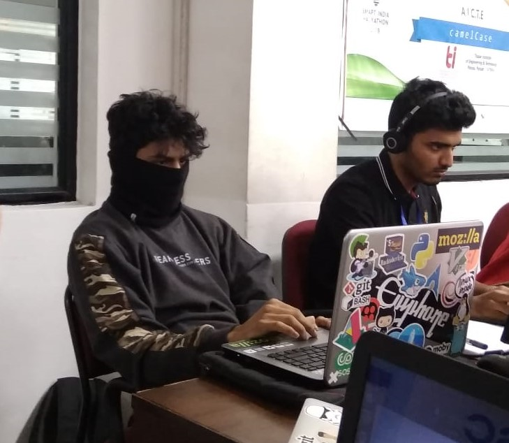

It all started on a normal, slow day when our Project-mentor told us to assemble in the seminar hall for an announcement, regarding SIH, supposedly the "World's biggest Hackathon", held annually. We were clueless but considered registering for it, only because our Project-mentor told us to do so.
Next thing I know, I'm added to a WhatsApp group with 5 of my batch-mates: Afroz, Bilal, Akashdeep, Sony and Shashank, all a part of SOSC, preparing to select a few problem statements, which we believed we could provide solutions for. We met up, finalised 3 or 4 problem statements and discussed their solutions, before mailing a presentation to our SPOC. 
Long story short, our presentation got selected for the grand final in Punjab; Soon, we found out that our trip to Lovely Professional University, Punjab & the accommodation was completely paid for, by the organisers.

Our problem statement was to create a portal that makes it simple to send Bulk E-mails and SMS' to subordinates.
We selected our Mentors: Rumaan K and Musthaq A from 4th year, CS and then divided ourselves into teams for front-end, back-end and miscellaneous work before we left.
It was winter in Punjab and we were freezing, but as soon as the 36-hour Hackathon started, we started hacking away with amazing energy.

We used ReactJS for the front-end and MongoDB Atlas for our Backend;
I initially worked on the front-end UI design, using a design provided by Musthaq, who would eventually also do the same.
The Judges evaluated us every 8 hours or so and made us present our solution and show our progress.
Some of us eventually grew tired and had to get some rest, for which there was a separate room, spread out with mattresses, where I would spent most of my time, unfortunately due to sickness.

 

There were several breaks during the hackathon, where we provided with refreshments and we also had an interactive web-session with the Indian Prime Minster, Mr Narendra Modi.
We were getting close to completing a working-solution to the problem; The final Evaluation was coming close and our application was able to send Bulk Mails and SMS' directly via the backend but there was a problem while we tried to connect it to our front-end React app. 
The Judges entered the Room for the final Evaluation and we demonstrated that our server was able to perform the required task, but the Judges were strict and told us that it isn't a functional portal if that was the case.
We spoke to a few of the other teams and got to know that most of them were not able to build a fully functional portal by the end of the Hackathon. The results were announced and we were really close, but didn't win.
Nevertheless, it was an unforgettable experience and we learnt a lot from it; We then moved on, and enjoyed the remaining days we had in Punjab, before returning to Mangalore

Team DSOSC

