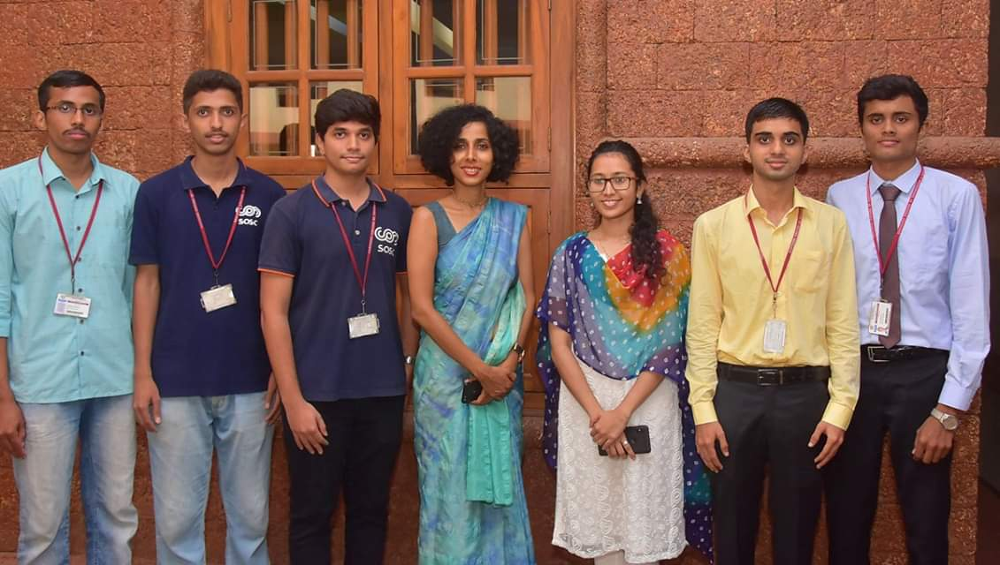

## Brief Intro About SAP Labs

SAP Labs India is a product company that is the forerunner in making Enterprise Solutions. SAP has been awarded as the best place to work multiple times. [Scholar@SAP](https://www.sap.com/india/about/careers/university-programs/students/vocational-training.html) is a globally recognized work integrated and learning program in partnership with [BITS Pilani](https://www.bits-pilani.ac.in/). As a Scholar, you will have the opportunity to rotate across SAP business areas while receiving on-the-job and structured development and coaching from leaders in technology.

## Hiring Process

SAP Labs had four rounds in their hiring process. Let me walk you through each of them.

### Round 1

First round was the online test which was conducted in Hackerrank. The test had MCQs on time complexity, data structures, algorithms and database. In addition to that,there were two coding questions. One of them was to sort the dates in ascending order and the other one was to print a given pattern.

10 students were selected from our college and it gives me great privilege to say that three of them are part of SOSC.🎉

We had to go to Alva's Institute of Engineering and Technology, Moodbidri for the further process. We had to assemble in the campus at 9am. There was a pre-placement talk which was followed by three rounds of interview. The process comprised of two technical interviews and an HR round,all of which were meant to eliminate the candidates.

### Round 2

In the first round of the interview, I was asked to name my favourite subject. I mentioned that it was OOP wherein the panel asked me to explain the four pillars of OOP by citing an example for each. Once I was done explaining ,she asked me the various elements I had mentioned in my resume. By the end of the process she asked me whether I have any questions for her and I asked her for the introduction. With that I was done with first round of my interview.

After a while they announced the results of first round and I was shortlisted for the next round.😃

### Round 3

In the second round of the interview which went on for about 30-40 minutes I was asked to explain each and every point I had mentioned in my resume. It began with me explaining about all the projects I had done with the utmost details.Followed by that,I was asked to write a pseudocode to check whether the number of brackets in a given string is balanced or not. He asked me a question on database wherein a table was given to me and I had to write an SQL query to access specific tuples. After this I was asked basic questions on networking like how to share files over FTP and how to detect a PC over the network. At the end he asked me a [puzzle](https://www.geeksforgeeks.org/puzzle-18-torch-and-bridge/), which I failed to answer.😅

As a whole,the entire interview process went pretty smooth 😊 and I was able to answer most of the questions. So the interviewer told me that I can proceed to the HR round.🤩

### Round 4

In the final round of the interview, I was asked to give a brief introduction about myself. There were two HR's in the panel who vividly explained me  about the Scholar@SAP program. They also asked me as to why I want to pursue higher studies and told me that there would be lot of pressure since I will have to manage both academics and work. Their question basically dealt with my strategies to tackle this problem.Once the HR round was completed,I was told to wait for the results.

When we were on our way back home, at around 8:30 the results were announced and 5 of them managed to clear from our college out of which 2 were from SOSC.

## Why do I keep mentioning about SOSC?

It is evident from all the above rounds that one of the most frequently asked question was: Tell me about yourself. So whenever I introduced myself I made it mandatory to mention that I am part of an open source community in our college which caused the conversation to last for the next 5-10 minutes.One of the major reason that creates a sense of fear among the candidates is the lack of content to present in the interviews. But once you begin addressing about your experiences,skills and engage in the process,the interviewers will take keen interest in learning more about you which ultimately proves to a good sign.  
Being in the SOSC team exposed me to various workshops which helped me in inculcating good communication skills and also enabled me to present good content in the interview.Moreover,we we have some a bunch of amazing seniors who are always ready to help. Community is a place where we all learn together and grow together and thats exactly what's happening in SOSC. If you want to know more about ow open source can help shape your IT career click [here](https://sosc.org.in/blog/how-open-source-can-shape-your-it-career).

## Few tips to crack SAP Labs

1. SAP being a ERP company requires you to have a decent knowledge on DBMS.
2. Learn Data Structures and OOP concepts thoroughly. Make sure you know atleast one of the OOP language.(C++ or Java preferred).
3. Ensure that the internship you are engaging in gives you a good platform to learn and in the process expose you to real life problems.Moreover,make sure that you have worked on a good project during your internship period.
4. Be a part of some technical club in your college. It makes a lot of difference!

## All the best and thanks for reading!🤗

Placed at SAP Labs

