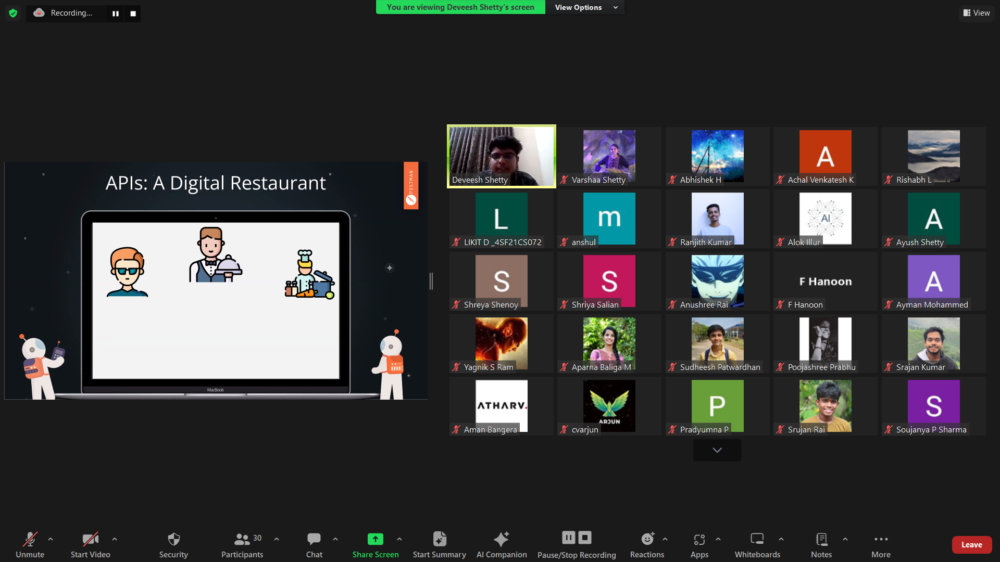
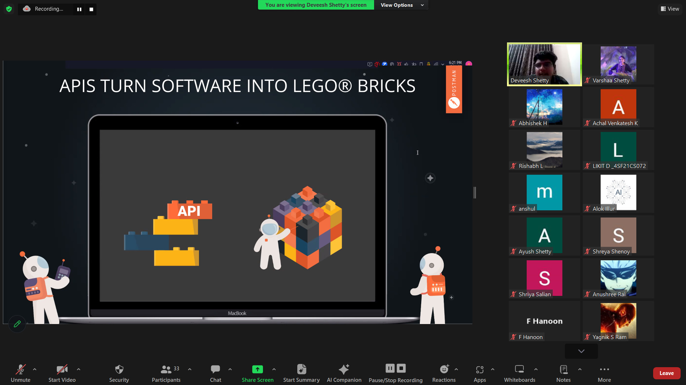
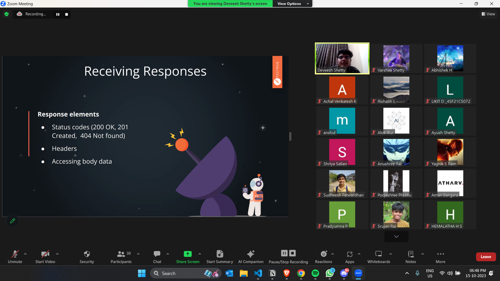
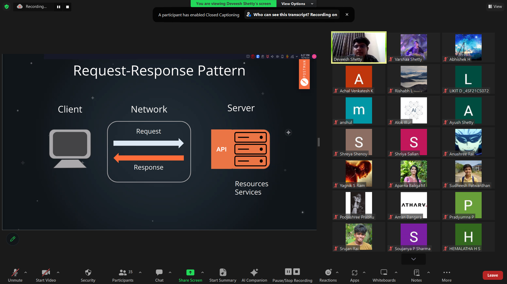

## Introduction:

With part one of Hacktoberfest done and dusted, the next leg of the SOSC X Hacktoberfest celebrations centred around a workshop on APIs: ‘API 101: with Postman’.
Helmed by Deveesh Shetty, the President of SOSC and a Postman Student Expert, the workshop focused on the importance, functioning and use of APIs in the software development space, using Postman: a collaborative platform offering tools for creating, deploying and testing APIs in a streamlined and easy fashion.

## Commencement of the virtual session:

The workshop was a virtual one, conducted via Zoom. Flagging off the workshop, the speaker introduced APIs, discussed their definition and use. Concepts were supported with engaging visuals and real-life examples, enabling attendees to solidify their understanding of the topics. The functionality of APIs in software development was discussed, highlighting the response-request mechanism. The three main components of a request- methods, address and path were also explained in detail.

## Introduction to Postman and a hands-on experience:

The session then segued into the direction of Postman, with the speaker giving a brief introduction of the platform, highlighting how it streamlines and simplifies the API experience for developers. Taking the session into a hands-on mode of learning, attendees visited the postman development environment, where they were taught to build requests in a step-by-step, guided manner.
Attendees built requests to the jokes repository and performed different functions like: ‘GET’, ‘POST’, ‘PUT’ & ‘DELETE’.

## Question and Answer Session:

The audience were then encouraged to ask any questions related to the topic, clearing any ambiguity and doubts that they might have encountered during the course of the session.

## Postman Student Expert Programme:

The speaker then introduced participants to exclusive learning resources and certification badges provided by Postman to aid them in their learning path. Attendees were encouraged to sign up for the Postman Student Expert Programme and participate in the exclusive ‘Postman Challenges’ and stand a chance to win exciting Postman goodies and swags.

## Closure:

Concluding the session on a high note, attendees developed a fundamental understanding of APIs and gained valuable insights into deploying APIs in their own personal projects.

### Media

    
 
        
    

    

       
    

    

        
    

    

        
    

  

