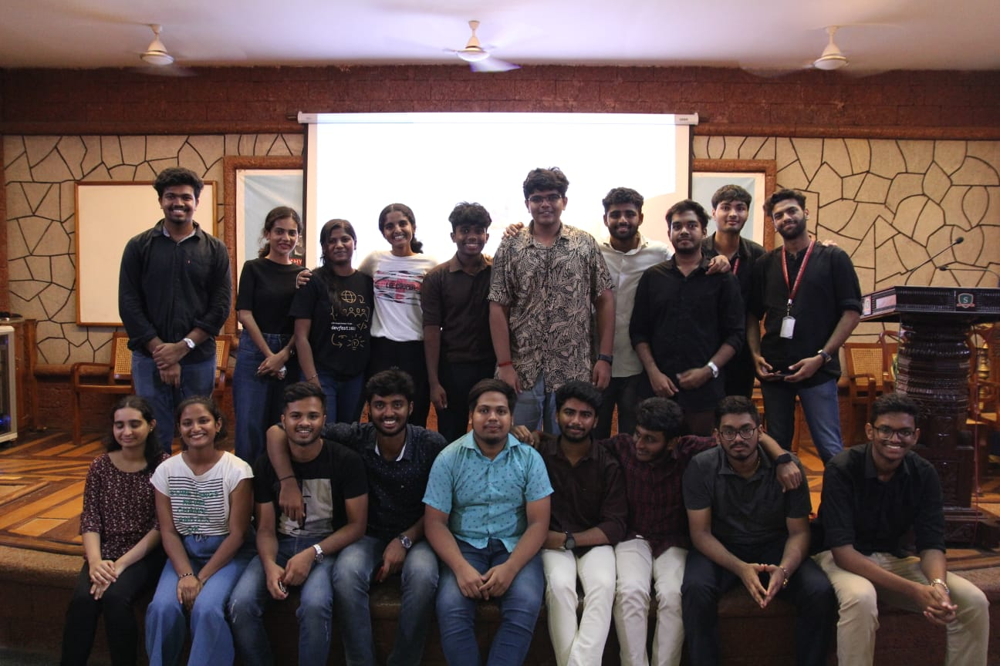
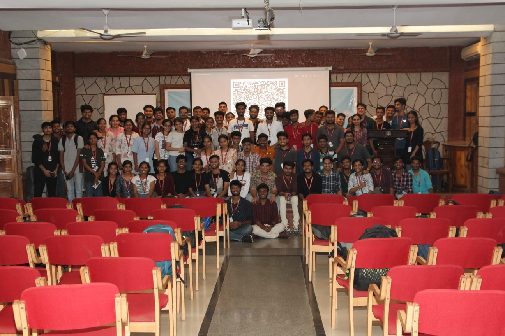

## Introduction:
The Sahyadri open source community (SOSC) conducted its Induction Program on [20/06/2023] at [Ground floor Seminar Hall]. The purpose of the event was to introduce the new team leads to the students and provide an overview of SOSC's goals and future plans. The program was led by the newly appointed President, Deveesh Shetty.

## President's Welcome and Team Introduction:
The program commenced with President welcoming all the participants and expressing gratitude for their presence. He then introduced the new leads of SOSC, highlighting their roles and responsibilities within the organization. This served to familiarize the participants with the individuals who would be leading the various initiatives of SOSC.

## Explanation of SOSC and Future Plans:
Following the team introduction, President provided a comprehensive explanation of what SOSC stands for and its core objectives. He emphasized the organization's commitment and discussed the various projects and initiatives that SOSC had undertaken in the past. Furthermore, the President outlined the future plans of SOSC, highlighting upcoming events, campaigns, and collaborations.

## Question and Answer Session:
After the presentation, an interactive question and answer session was conducted. Participants had the opportunity to ask clarifying questions about SOSC, its activities, and the scope of involvement. The President and other team leads addressed the queries raised, ensuring a clear understanding of the organization's purpose and functioning.

## Riddle Competition:
To engage the participants and add an element of fun to the event, the team organized a riddle competition. The participants were challenged with a riddle, and the first person to solve it correctly would win a sticker as a prize. This activity encouraged active participation and created a lively atmosphere during the induction program.

<!-- SOSWC Announcement:
<Add things here> -->
.
## Introduction of Tech Leads:
Following the riddle session, each tech lead was given the opportunity to present and explain their respective domains. This session provided participants with insights into the different areas of expertise within the organization and helped them understand the team structure.

## Kahoot Session:
After the domain introductions, a Kahoot session was organized by Rishab and Achal. Kahoot is an interactive online quiz platform that engages participants in a competitive and enjoyable manner. The session aimed to enhance team bonding and create a fun learning environment.

## Sticker Distribution:
To acknowledge the winners of the Kahoot session, stickers were distributed to those who achieved the highest scores. This recognition served as a token of appreciation and motivated participants to actively participate in future activities.

## Group Photograph:
The induction program concluded with a group photograph of all the participants, capturing the memories and camaraderie built during the session. This photograph can be used for internal communications and as a memento of the event.

## Conclusion:
The SOSC Induction Program successfully achieved its objectives of introducing new leads to the organization's culture, teams, and work domains. The combination of interactive activities such as the riddle session, domain presentations, Kahoot quiz, and recognition through sticker distribution created an engaging and enjoyable experience for all participants. The program fostered team bonding and provided a solid foundation for the new recruits to integrate into the organization seamlessly.

We believe that the induction program has set the stage for a productive and collaborative work environment at SOSC. We look forward to the contributions of our new recruits and their growth within the organization.

### Media

    
 
     
    

    

      
    

    

      
    

    

      
    

    

      
    
