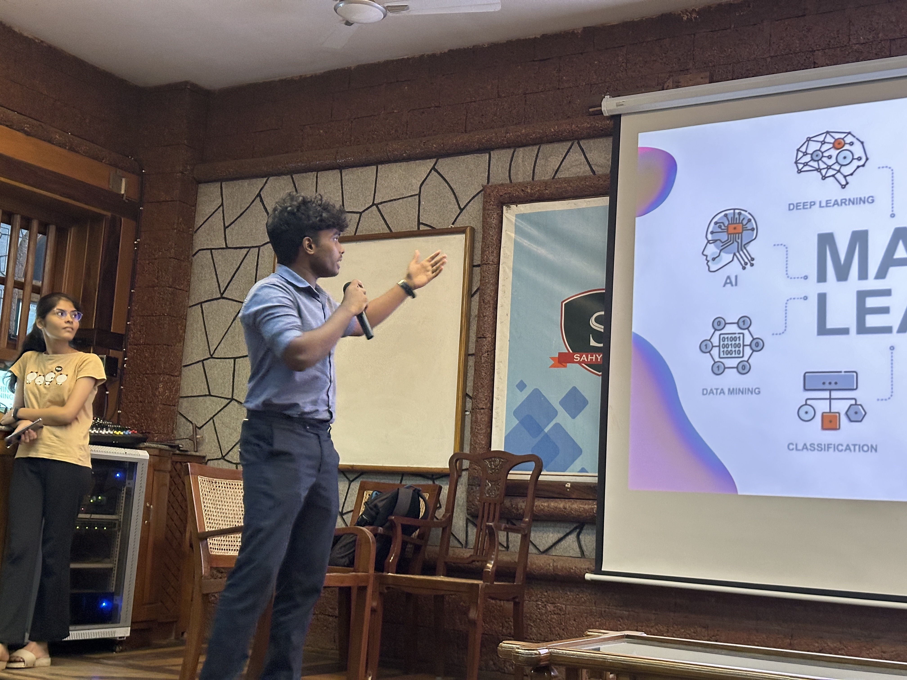

## Workshop on Artificial Intelligence and Machine Learning

"Artificial Intelligence and Machine Learning Workshop" organized by GDSC x SOSC

### Date and Time: 29th January 3:30 PM

## Speakers

- [Srujan Rai](https://www.linkedin.com/in/srujan-rai), Computer Vision and IoT Lead - SOSC

## Post-Event Report

The workshop covered a range of topics in Artificial Intelligence and Machine Learning, starting from the fundamentals. This included an introduction to "Machine Learning," exploration of associated technologies, programming languages, frameworks, and libraries. Regression algorithms like linear regression, KNN (K-Nearest Neighbors), and the random forest process were discussed. The session also delved into "deep learning," highlighting distinctions from "Machine Learning" and "Artificial Intelligence." Fundamental concepts such as Activation Functions and Neural Networks were introduced.

The workshop seamlessly combined theory with hands-on experience, culminating in a practical project on handwriting recognition. Participants generated a small dataset by creating various numbers in MS Paint. Machine learning algorithms, utilizing different Python libraries, were employed to predict the numbers detected. 

The event was considered a resounding success, providing students with exposure to cutting-edge concepts and technologies in AI and ML. Participants gained valuable insights and had the opportunity to immerse themselves in the practical application of machine learning, experiencing its transformative potential firsthand. The workshop left a lasting impact, inspiring curiosity and fostering enthusiasm for the fascinating world of AI and ML among the attendees.

## Prerequisite

- A laptop
- Mouse is recommended

## Media

    
 
     
    

    

      
    

  

