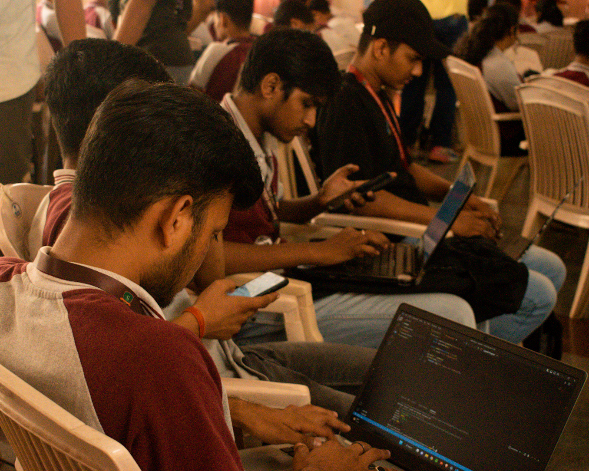
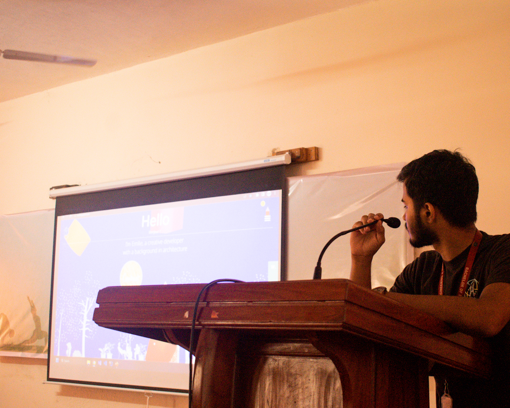
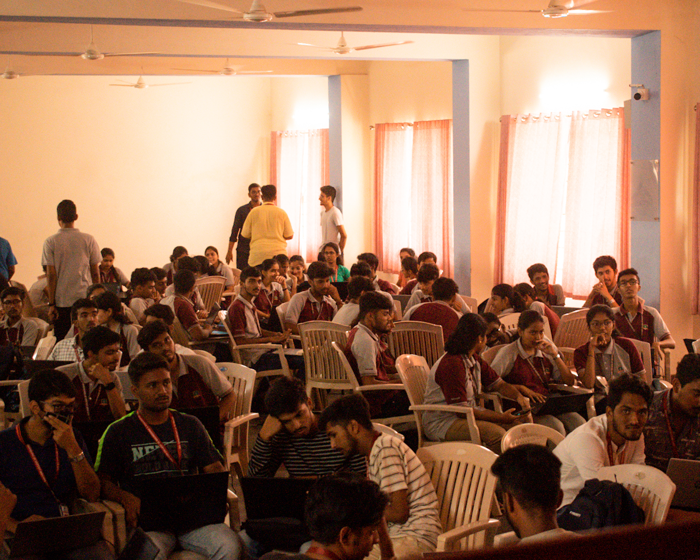
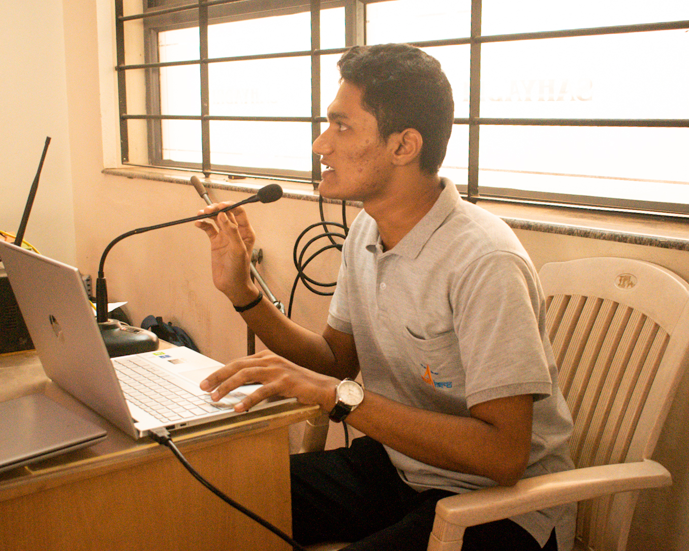

## Backend Workshop on Node.js and ExpressJS

The Node.js workshop was an immersive session that provided participants with a comprehensive understanding of Node.js, a powerful JavaScript runtime environment for building web applications. Through hands-on exercises and projects, attendees learned fundamental concepts such as event-driven programming and the Node.js module system. They gained practical experience in creating server-side applications, handling HTTP requests, and interacting with databases. The workshop also covered advanced topics like Express.js and integrating third-party libraries, emphasizing best practices, performance optimization, and security considerations. By the end of the workshop, participants had a strong foundation in Node.js development, with practical knowledge of building scalable and efficient web applications using Express.js and industry-standard practices.

### This is a Free community driven workshop, there is no fee to attend the workshop!

### Date and Time: 31st March 11:00 AM

## Topics covered

In summary, the Node.js workshop equipped developers with the skills and knowledge needed to leverage the power of Node.js in their web development projects. They gained a solid understanding of Node.js fundamentals and were able to build robust applications while adhering to best practices. The workshop empowered participants to confidently utilize Node.js and its associated frameworks to create scalable and performant web solutions.

## Prerequisite

- Laptop with Internet Connectivity
- Curious mind and will to learn something exciting

## Media

    

    

    

    

