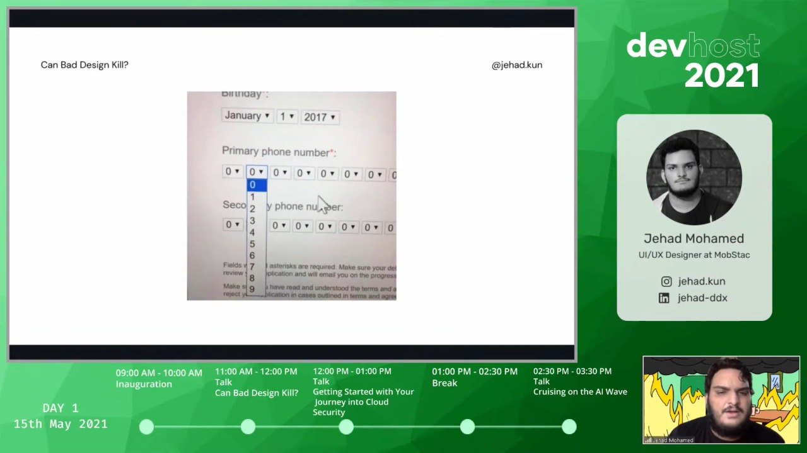
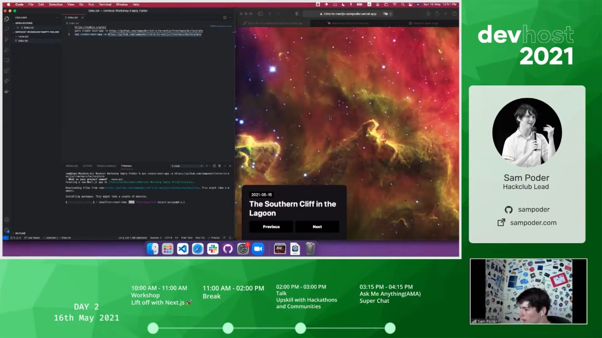
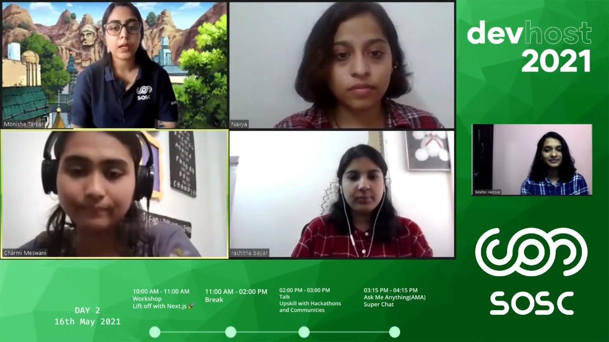

## About the event
devhost is the annual flagship event of SOSC. Our prime goal is to bring young and skilled student developers from anywhere across the globe under the same umbrella. This event aims to create a platform to collaborate with various clubs and organizations, discuss the newest technologies and trends in the IT industry an also train students for the same. devhost:20 claims to be a tech extravaganza, and the biggest event under SOSC so far.

Considering the ongoing pandemic, devhost:21 will be an online event.

## Schedule

---
### Can Bad Design Kill
**Time**: 15th May, 11:00 AM - 12:00 PM

In this session we will be talking about design in general and how it has grown from just being used in niche user apps to more sensitive systems that deal with medicine, digital policing, vehicular systems etc where bad UX can have more impact than just the user getting irritated. Now being a part of every such impactful industry - bad design can have unseen ramifications when it comes to effecting safety and health. We'll discuss what is design- how it has grown, followed by Bad Design and in what spectrum bad design becomes dangerous.
#### Speaker
- [Jehad Mohamed](https://jehadmohamedz.wixsite.com/meep/), UI/UX Designer at MobStac

---
### Getting Started with Your Journey into Cloud Security
**Time**: 15th May, 12:00 PM - 1:00 PM

Most organizations use cloud services in one way or another to run their workloads. In this session, we will see how we can get started on our journey in the vast domain of Cloud Security. Along with an interesting interaction to instil a deeper understanding of the fundamentals of working with the cloud, Madhu will share his experiences too.
#### Speaker
- [Madhu Akula](https://madhuakula.com/), Creator of Kubernetes Goat

---
### Cruising on the AI wave
**Time**: 15th May, 2:30 PM - 3:30 PM

We encounter artificial intelligence in almost all our daily tasks: speech-to-text, photo tagging technology, fingerprint recognition, spam classification. We see it contributing to cutting-edge innovations: precision medicine, injury prediction, use-cases like predicting diabetic retinopathy, and autonomous cars. This session will talk about the advancements of AI in the industry, how this wave started, and its future.
#### Speaker
- [Siddhant Aggarwal](https://about.me/siddhantagarwal/), Program Coordinator at Google India

---
### Lift off with Next.js 🚀
**Time**: 16th May, 10:00 AM - 11:00 AM

Next.js is taking over the React galaxy. In this talk we’ll learn the framework through building a website that uses many of Next.js’s core features such as API Routes, ISR & Dynamic Routing.

#### Speaker
- [Sam Poder](https://sampoder.com/), Hackclub Lead, Founder of the Singapore STEM Club
  
---
### Upskill with Hackathon and Communities
**Time**: 16th May, 2:00 PM - 3:00 PM

The prime intent of a community is to acquaint students with the ecosystem (pertaining to the domain of that particular community) and develop skill sets by providing effective training. We are a community which believes in knowledge for all. Join Siddharth in this interactive session to know more about Communities and Hackathons. Hackathons are another fun medium to promote learning. In today's times, the importance of hackathons in the technical sphere has reached new limits.

#### Speaker
- [Siddharth Dayalwal](https://www.instagram.com/siddharth_hacks/), Community Development Intern at SAWO labs

---
## Prerequisites
- Internet Connection because the entire event is hosted online
- Curious mind and will to learn something exciting

## Venue
Online live stream on [Youtube](https://www.youtube.com/channel/UCk8nlSMwUT-jhEtamMF-V-w)

## Absolutely Free!
Since this is a community driven event, there is no fee to attend the workshop but attendance is mandatory if you are registering for the workshop to avoid blacklisting for future workshops.

## Post Event Report
Devhost:21 was the third edition of the annual student developers meet organised by Sahyadri Open-Source Community (SOSC) to bring together young and talented developers from in and around Mangalore. Devhost:21 was aimed to create a platform to join together clubs and organizations to spread the information on latest technologies and trends in the IT industry and train the students to be part of it.

Devhost:21 was a two day event which took place on 15 and 16 May 2021. It had speakers from notable organisations.Due to the covid-19 pandemic the event was conducted online on YouTube.

### Day 1
Mr.Prakhyath Rai, the ex-faculty coordinator of SOSC inaugurated Devhost:21. The inauguration was followed by a talk from one of the SOSC alumni

### Can bad design kill?
The first session  was taken by SOSC alumnus Jehad Mohamed who currently works as a  UI/UX designer at MobStac. The session  was mainly focused on different types of designers and how bad design can potentially kill many lives.The session also threw light on how engineering students can get into design by upskilling design skills and techniques.

### Getting Started with Your Journey Into Cloud Security
The session was followed by a talk on Cloud security by Madhu Akula the  creator of Kubernetes Goat. The session mainly revolved around basics of Cloud Security and it's important  terminology. He shared many resources using which students can kick start their journey in Cloud security. He also explained  about different  methods of cloud security and also explained about different cloud services like AWS, Azure etc.

### Cruising on the AI wave
The final session of the day was taken by ex-google employee Siddhanth Aggarwal.In the session he talked about the advancements of AI in different industries, how the AI wave started, and the future of AI. He also talked about how AI is controlling our day to day lives right from fingerprint detection to photo tagging technology.

### Day 2
### Lift off with Next.js
Day 2 of Devhost:21 was kickstarted with a workshop by Sam Poder, a  high schooler from Singapore.He conducted a workshop on Next.js and  emphasized how Next.js is taking over the React galaxy. He explained about Next.js’s core features such as API Routes,ISR & Dynamic Routing and he even built a website using NASA's API which fetches the most fascinating space photos.

### Upskill with Hackathons and Communities
The final talk of Devhost:21 was given by Siddharth Dayalwal who is a lead in many clubs and communities. He explained about the impacts of hackathons and communities and how they can provide students with a pool of opportunities. He even shared his experience on different hackathons and he gave pointers on how to successfully win hackathons and how to grow as a developer by networking with other hackers during hackathons.

### Q&A session
Devhost:21 was wrapped up with a Q&A session which included SOSC alumnae Charmi,Monisha,Navya and Rachitha. They talked about women in tech and  they highlighted the importance of participating in open source communities.They even shared their experiences working as software  engineers in MNC's. 

The day ended with a thank you speech by SOSC president Akashdeep Bhagat to the speakers and all the attendees. The event was a grand success as this brought many like minded people and communities together in one place.

### Media

