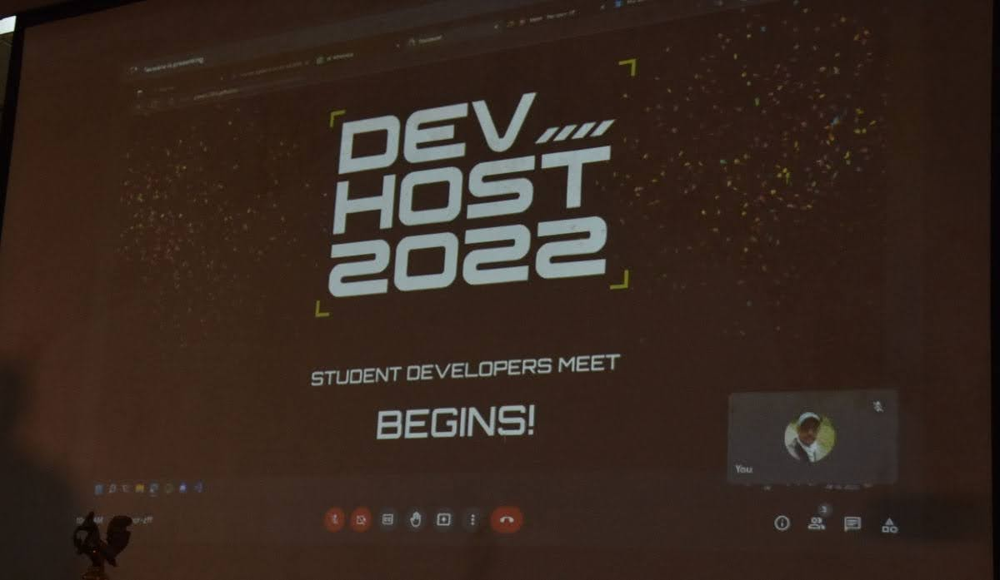
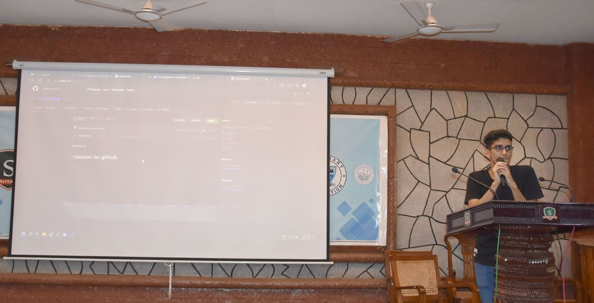
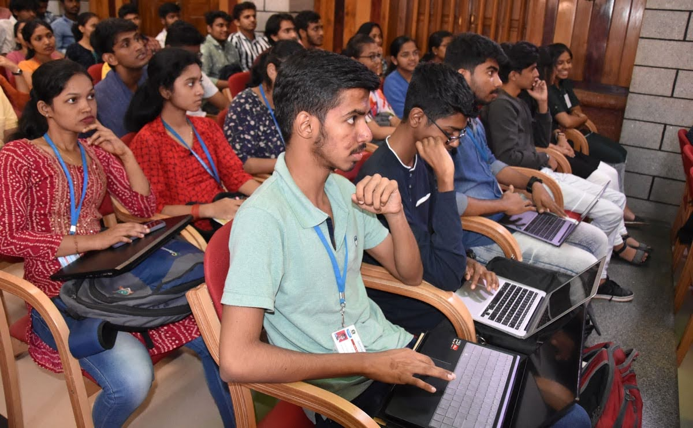
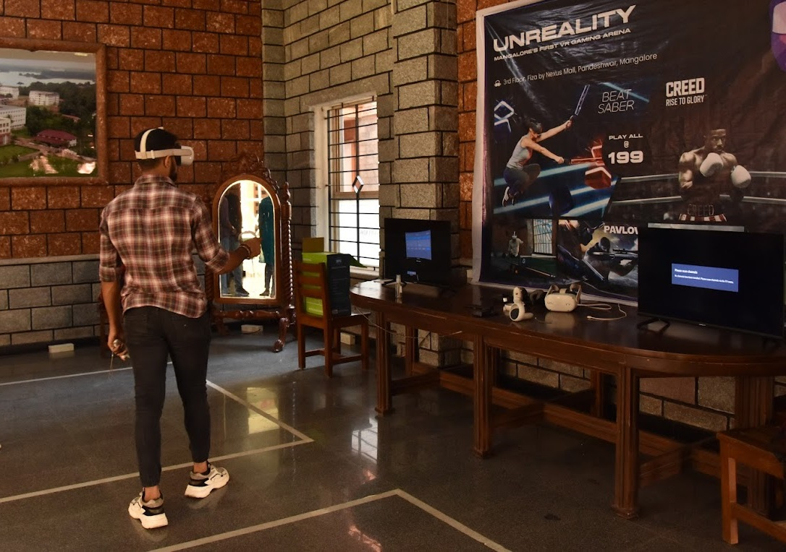

## Website

- Register here - [devhost:22](https://devhost22.sosc.org.in/)

## About the event

devhost is the annual flagship event of SOSC. Our prime goal is to bring young and skilled student developers from anywhere across the globe under the same umbrella. This event aims to create a platform to collaborate with various clubs and organizations, discuss the newest technologies and trends in the IT industry an also train students for the same. devhost:22 claims to be a tech extravaganza, and the biggest event under SOSC so far.

## Schedule

---

### Git started with Git & Github

**Time**: 28th October 2022, 10:00 - 11:00 AM

The workshop will cover basics of using the Version Control System - Git and how to collaborate effectively on your projects using GitHub. Not just Git push and run but how to tackle difficult situations and how to find help. The workshop will also cover the benefits of being an open source contributor and how to be an open source contributor

#### Speaker

- [Vishnu](https://github.com/carbonxx) - President, SOSC
- [Fawaz](https://github.com/fauwara) - Vice President, SOSC

### Kickstart Machine Learning

**Time**: 28th October 2022, 11:00 - 12:00 PM

Its the month of Hacktoberfest. During this month millions of passionate open source contributors come together and contribute to various open source repositories. During this month many people contribute to ML repositories as well. Machine learning is growing at a rapid pace today. Each and every tech company uses ML in one way or the other. Hence in this session we’ll be learning more about ML in open source.

#### Speaker

- [Arnav Agrawal](https://www.linkedin.com/in/arnavagrawal22/), Founder - Manipal Open Source Society

### REACTion Time

**Time**: 28th October 2022, 11:00 - 12:00 PM

ReactJS is the most popular open-source javascript library designed by facebook to create single page web or mobile applications. In this interactive workshop, you’ll learn the basics of what React is, why we need Reactjs and create a front end application together.The workshop will cover details of what exactly is react, Basics of Javascript, how do you interact between components and some knowledge of API integration.

#### Speaker

- [Arun Kumar](https://www.linkedin.com/in/arun-kumar-9912b7165), Software Developer at Skillmine Technology

---

### DIVE INTO THE WORLD OF UX

**Time**: 28th October 2022, 2:00 - 4:00 PM

Ever wondered how big tech companies develop awesome user interfaces and user experiences? Nowadays due to the shortened attention span of users, effective UI/UX plays a major role in many large companies. UI and UX design are often used interchangeably, but actually they mean very different things. Good UI/UX design is very important for attracting users. Hence join this amazing session to get started and dive deep into the colourful world of UI/UX.

#### Speaker

- [Jehad Mohamed](https://www.linkedin.com/in/jehad-ddx/), Designer at Beaconstac HQ

### Life after the coding interview

**Time**: 29th October 2022, 9:00 - 10:00 AM

Ever wondered what happens after cracking the coding interview? Do you ever wonder how big tech companies operate? Do you want to change domains after starting a job? Do you want to pursue masters in the US? Well, navigating through life after your degree is not as easy as it looks. If you too are worried and have similar questions popping up in your mind, then join this amazing session by Navneeth Kumar.

#### Speaker

- [Navneeth Krishna](https://www.linkedin.com/in/navneeth-krishna-b3874412a/), Co-founder of SOSC

### Testing large scale products

**Time**: 29th October 2022, 9:00 - 10:00 AM

Testing is a very important step in the Software Development Life Cycle. Testing helps us avoid critical errors. In this session you will learn testing basics, testing workflow as well as the types of testing.You will even gain knowledge on how testing is done in companies. So join this amazing session to know the ins and outs of testing.

#### Speaker

- [Ashia Nagi](https://www.linkedin.com/in/ashianagi/), Software Engineer II at JPMorgan Chase & Co.

### Springing into the world of springboot

**Time**: 29th October 2022, 11:00 - 12:00 PM

Java Spring Boot (Spring Boot) is a tool that makes developing web applications and microservices with Spring Framework faster and easier. It lets you create standalone applications that run on their own, without relying on an external web server. How exactly it is used and what makes it better than other frameworks, all this will be covered in an intriguing session that will be taken up by Varathraj K.

#### Speaker

- [Varatharaj K](https://www.linkedin.com/in/varatharaj-k-680505141/), R3 Corda Developer

### Database and SQL 101

**Time**: 29th October 2022, 11:00 - 12:00 PM

Dhivya Elangovan is a Data Engineer. She has more than 3 years of experience as a database developer. She is well versed with all the data handling tools and technologies like Microsoft SQL Server, Oracle Database,PostgreSQL, MySQL and many more.She was working as a Software Developer at Agile Health, Inc. Currently she is working as a Data Engineer at Heptagon Technologies.

#### Speaker

- [Dhivya Elangovan](https://www.linkedin.com/in/dhivya-elangovan-b87363168/), Data Engineer at Heptagon Technologies

### BUIDLing Crypto Currenncy

**Time**: 29th October 2022, 2:00 - 4:00 PM

Blockchain is a record-keeping technology designed to make it impossible to hack the system or forge the data stored on it, thereby making it secure and immutable. It is a type of distributed ledger technology (DLT), a digital system for recording transactions and related data in multiple places at the same time. We all know that blockchain is used for crypto. So what exactly is blockchain? How is it used? And an interesting session of Create Your Own Cryptocurrency on Ethereum Workshop will be done by John.

#### Speaker

- [Immanuel John](https://www.linkedin.com/in/immanueljohnprofile/), Blockchain Developer

- Monish

## Gaming Events

### Valorant

**Date**: 28th October 2022

Gather your teammates and gear up for some action packed matches! Get ready to witness intense clutches and nail biting action at this Valorant Tournament! Only the best of the best shall rise to the top! Exciting prizes await the best team!

### BGMI

**Date**: 29th October 2022

Gather your squad and gear up to battle it to the top! Get ready to witness intense clutches and nail biting action at this BGMI Tournament! Only the best of the best shall secure the chicken dinner! Exciting prizes await the winners!

### Unreality

**Time**: 28th - 29th October 2022

With all the hype going around Metaverse, we are pretty sure you know about Virtual Reality. We at SOSC also believe VR is the future! Hence to get our participants a taste of VR, we’ve partnered with our friends at Unreality to bring to you a spectacular VR gaming experience at our event.

## Hackathon

### HackNight22

**Time**: 30th October 2022, 10:00 AM

HackNight is a 20-hour long hackathon organized by Sahyadri Open Source Community (SOSC) in celebration of Hacktoberfest 2022. Hacktoberfest is open to everyone in our global community. Whether you’re new to development, a student or a long-time contributor, you can help drive growth of open source and make positive contributions to an ever-growing community. All backgrounds and skills levels are encouraged to complete the challenge. Through HackNight over 800+ hackers have developed 200+ projects and have won ₹70000+ in prizes so far.

## Prerequisites

- A laptop with Internet Connectivity
- Curious mind and will to learn something exciting

## Absolutely Free!

Since this is a community driven event, there is no fee to attend the workshop but attendance is mandatory if you are registering for the workshop to avoid blacklisting for future workshops.

### Media

    

    

    

    

