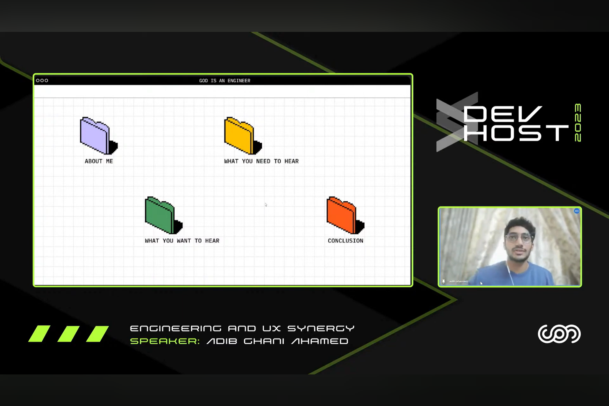
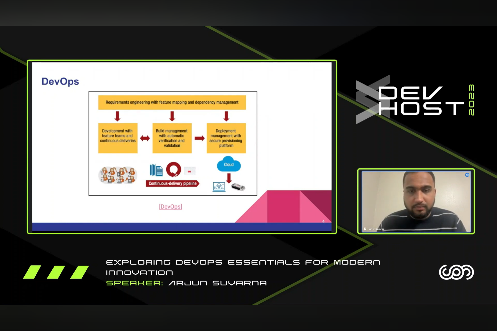
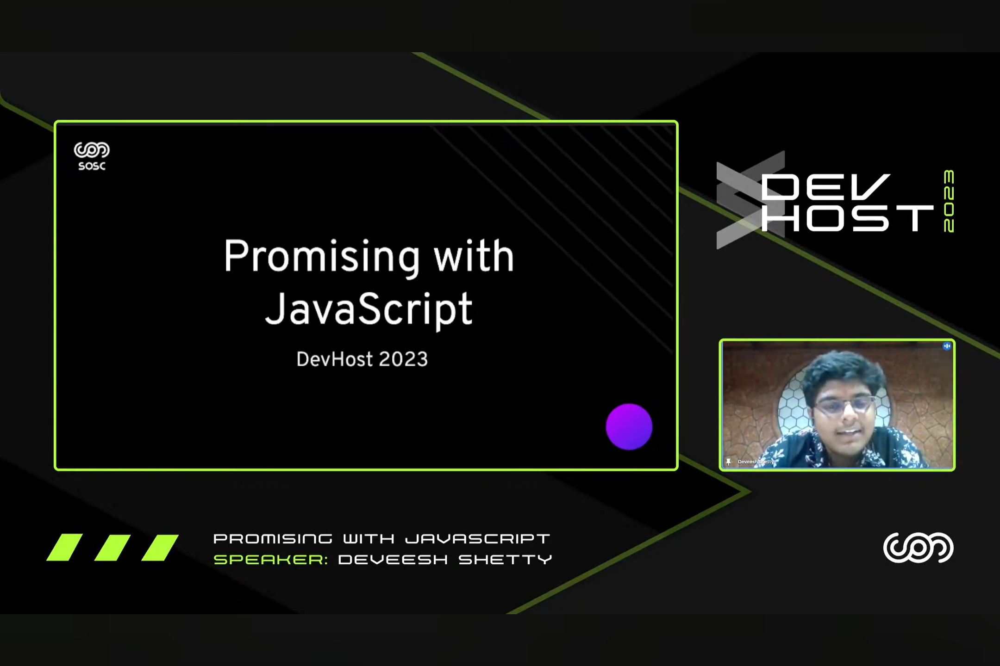
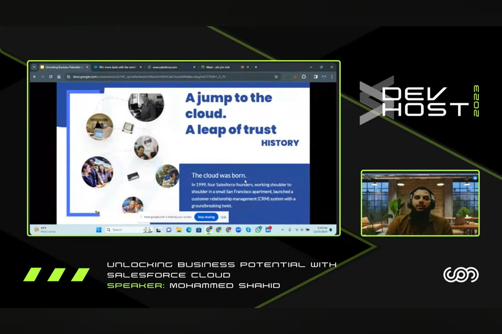
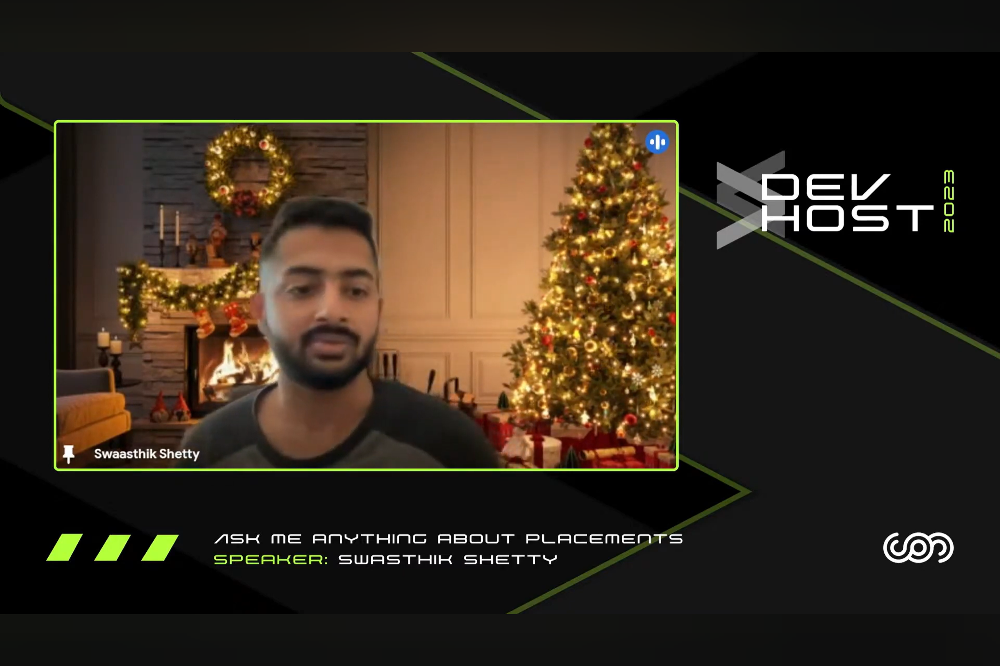

Are you ready to dive into the tech world, explore different domains and experience one of the most enriching and immersive student-developer meet of the year?

Join us for talks from leading industry experts and pioneers from around the world 🌐

## About the Event

DevHost is the annual flagship event of SOSC. Our prime goal is to bring young and skilled developers from in and around Karnataka under the same umbrella. This event aims to create a platform to collaborate with various clubs and organizations, discuss the newest technologies and trends in the IT industry and also train students for the same.

For more details visit the [Devhost 2023 Website](https://devhost.sosc.org.in/)

## Talks

### Unlocking Business Potential with Salesforce Cloud

- Date & Time: 23rd, 05:00 pm - 07:00 pm
- Speaker: [Mohammed Shahid](https://www.linkedin.com/in/shahidbit/)
- About Speaker: Experienced Salesforce Developer specializing in Apex, Triggers, Aura, and LWC, currently serving as the team lead at Novigo Solutions.

### Exploring DevOps Essentials for Modern Innovation

- Date & Time: 23rd, 07:00 pm - 08:30 pm
- Speaker: [Arjun Suvarna](https://www.linkedin.com/in/arjun-suvarna/)
- About Speaker: Master of Science and Graduate Research Assistant at The University of Texas at Arlington, USA. Former Java Full Stack Developer at IBM with expertise in Spring Boot, Angular, Cloud, CI/CD, Node.js, and Python.

### Engineering and UX Synergy

- Date & Time: 24th, 11:00 am - 12:30 pm
- Speaker: [Adib Ghani Ahamed](https://www.linkedin.com/in/adib-kalopsia/)
- About Speaker: Senior UI/UX Designer at Novigo Solutions with a strong background in graphic design. Former Design Head at SOSC, bringing 5 years of expertise in UI/UX.

### Ask me anything about Placements

- Date & Time: 24th, 02:00 pm - 03:30 pm
- Speaker: [Swasthik Shetty](https://www.linkedin.com/in/swaaz/)
- About Speaker: Cloud Solutions Engineer at Google. Formerly led open-source communities, including GitHub Campus Expert, Microsoft LSA, HackClub, Codechef, and SOSC.

### Promising with JavaScript

- Date & Time: 24th, 03:30 pm - 05:00 pm
- Speaker: [Deveesh Shetty](https://www.linkedin.com/in/deveesh-shetty/)
- About Speaker: Frontend Developer and the President of Sahyadri Open Source Community, Postman Student Leader at SCEM. Intern at Niveus Solutions, Mangalore. Loves building projects. Exploring Cloud and DevOps.

## Media

    
 
        
    

     
 
        
    

     
 
        
    

     
 
        
    

 
    

