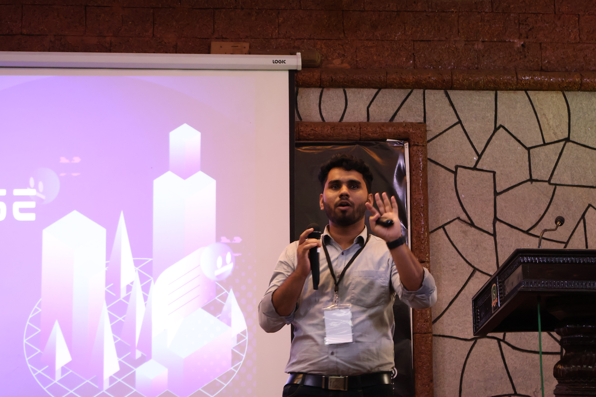
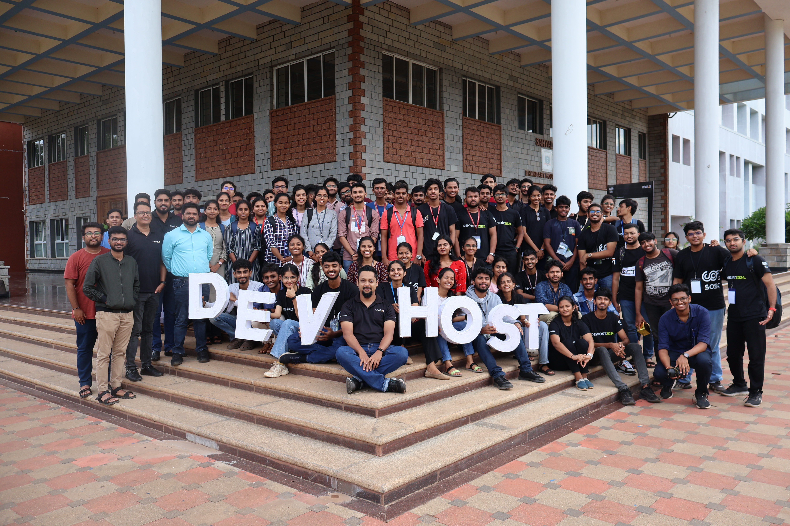
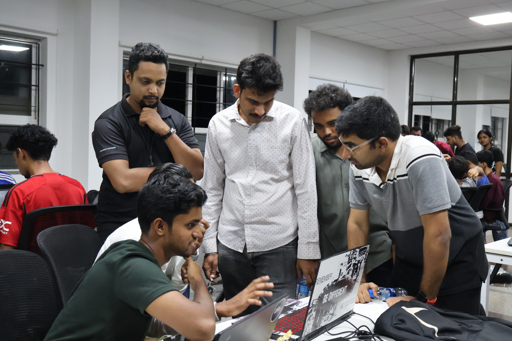

Are you ready to dive into the tech world, explore different domains, and experience one of the most enriching and immersive student-developer meets of the year?

Join us for a series of talks, workshops, competitions, and a thrilling hackathon!

## About the Event

DevHost is the annual flagship event of SOSC. Our prime goal is to bring young and skilled developers from in and around Karnataka under the same umbrella. This event aims to create a platform to collaborate with various clubs and organizations, discuss the newest technologies and trends in the IT industry, and train students for the same.

For more details, visit the [DevHost 2024 Website](https://devhost.sosc.org.in/).

## Schedule

## 14th June - Day 1:

### Inaugural Keynote
**9:00 am - 09:30 am**

### From Passion to Profit: Niveus' Journey from Startup to Scalability  
**Talk**  
**Suyog Shetty**  
**10:00 am - 11:00 am**  
**Ground Floor Seminar Hall**

---

### The Multiverse of OS: A Deep Dive into Dual Boot, VMs, and Containers  
**Talk**  
**Nibraz Rehman**  
**11:15 am - 12:15 pm**  
**Ground Floor Seminar Hall**

---

### Open Networking  
**Discuss and Interact with the speakers and guests**  
**12:15 pm - 12:45 pm**  
**Open Area Lounge**

---

### Lunch Break  
**12:45 pm - 01:45 pm**

---

### DevOps Fundamentals: Building a Strong Foundation  
**Master Class**  
**Rajesh Nayak, Pruthvija Shetty, Roshan Y**  
**01:45 pm - 04:00 pm**  
**Skill Lab - 1**

---

### Level Up Your Web3 Game using Smart Contracts  
**Master Class**  
**Subodh**  
**01:45 pm - 04:00 pm**  
**Skill Lab - 2**

---

### Open Networking  
**Discuss and Interact with the speakers and guests**  
**04:00 pm - 05:00 pm**  
**Open Area Lounge**

---

## 15th June - Day 2:

### Unlock Your Earning Potential: From Engineering to Corporate  
**Talk**  
**Nikhil Raj**  
**10:30 am - 11:15 am**  
**Ground Floor Seminar Hall**

---

### From Coastal Town to IT Hub: The Rise of Mangalore's IT Industry  
**Panel Discussion**  
**Shashir Shetty, Shihab Kalander, John Fernandes**  
**11:30 am - 12:00 pm**  
**Ground Floor Seminar Hall**

---

### Open Networking  
**Discuss and Interact with the speakers and guests**  
**12:15 pm - 12:45 pm**  
**Open Area Lounge**

---

### Lunch Break  
**12:45 pm - 01:45 pm**

---

### Cracking the MAANG Code: What It Takes to Get Hired in Top IT Companies  
**Panel Discussion**  
**Nikhil Raj, Prasanna, Ram Balakrishnan**  
**01:45 pm - 02:15 pm**  
**Ground Floor Seminar Hall**

---

### 10X Your API Productivity: Mastering APIs using Postman  
**Master Class**  
**Mohit P. Tahiliani**  
**02:30 pm - 04:30 pm**  
**Skill Lab 1**

---

### GEN AI for Dummies: A Beginner's Guide to LLMS  
**Master Class**  
**Akshay Kumar U**  
**02:30 pm - 04:30 pm**  
**Skill Lab 2**

---

### Open Networking  
**Discuss and Interact with the speakers and guests**  
**04:30 pm - 05:00 pm**  
**Open Area Lounge**

---

### Hackathon Registration / Onboarding  
**Ground Floor Seminar Hall**  
**05:00 pm - 05:30 pm**  
**20 Teams to be participating offline in the Venue.**

---

### Hackathon Kick-off  
**06:00 pm**

---

## 16th June - Day 3:

### Mentoring  
**Jaison Dias, Amrit Shenava**  
**12:00 am - 04:00 am**  
**On their respective places**

---

### Hackathon Ends + Presentation  
**02:00 pm - 04:00 pm**  
**Ground Floor Seminar Hall**

---

### Keynote by Judges  
**04:00 pm - 04:30 pm**  
**Ground Floor Seminar Hall**

---

### Valedictory and Prize Distribution   
**04:30 pm - 05:00 pm**

---

## Media

  
 
    
  

  
 
    
  

  
 
    
  

  
 
    
  

 
  

