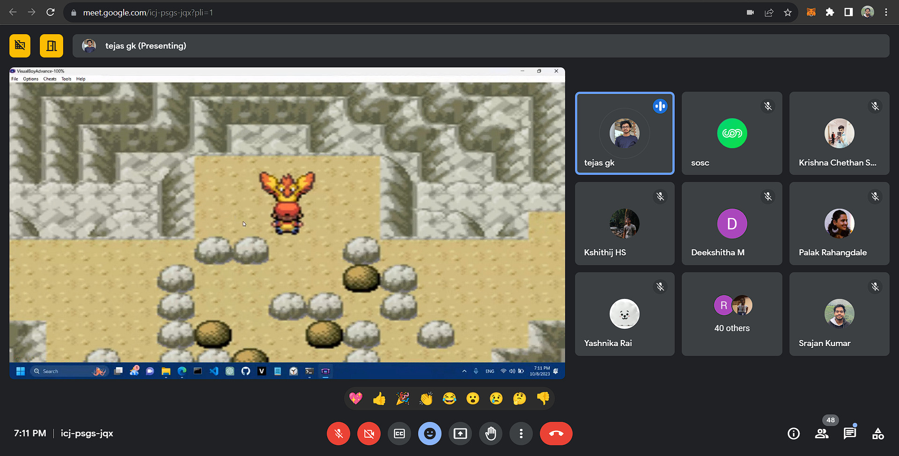
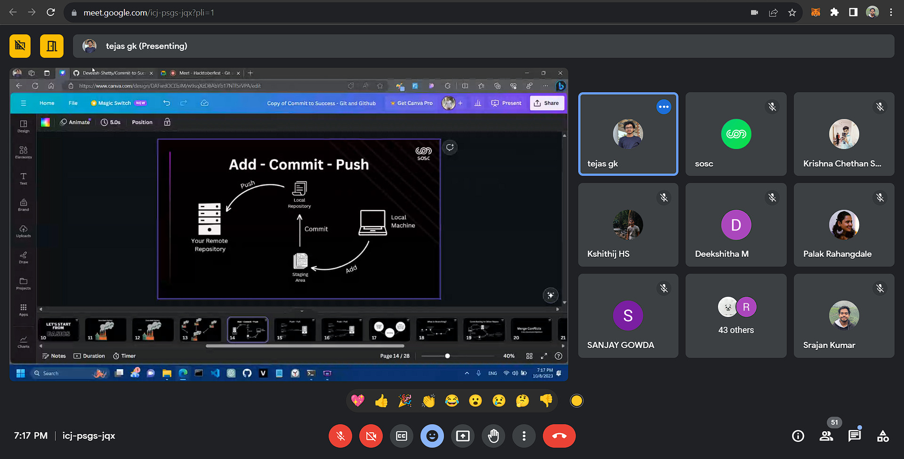

## Introduction:

Kickstarting Hacktober Fest with a comprehensive and immersive workshop on Git & GitHub was the best way to flag off the month-long festivities! With open-source at the cornerstone of Hacktober Fest and SOSC both, the workshop proved to be a well-fitting opening wedge into ‘Hacktober’.
Led by the web development lead here at SOSC, Tejas G.K, the workshop focused on version control using Git, and learning how to navigate through repositories, pull requests and commits on GitHub.

## Commencement of the virtual session:

The session was conduction via Google Meet, ensuring a wider reach to interested audiences. Our marketing lead, Pratheeksha welcomed everyone with a brief on Hacktober Fest and SOSC, highlighting our commitment to furthering the cause of open source and empowering the student community with technical training, mentorships and skills.
The speaker then followed up with a quick introduction to ‘version control’, discussing its definition, importance and features. Colourful visuals and engaging graphics were used with real-life examples to explain the theoretical concepts, which helped participants gain a better understanding of the topics.

## A Hands-on experience:

The session soon transitioned into a hands-on experience, with participants being taught to use basic Git commands like : ‘Git Add’,’Git Push’,’Git Commit’. Live demonstrations of the commands,coupled with a step-by-step guide helped attendees follow the instructions with ease.

## Question and Answer Session:

The session was kept interactive by opening up the floor for questions from the virtual audience to clear any doubts or difficulties that may have arisen in the understanding of concepts. Participants engaged meaningfully and learned by asking questions.

## Closure:

Towards the end of the session, resources were shared with attendees to aid them in their exploration of Git & GitHub. The session came to a close with attendees having gained an insightful experience and having developed a strong understanding of version control, open source and were prepared to take their first steps towards making their own contributions to open source repositories.
Overall, the workshop was highly informative and immersive, leaving a lasting and valuable impact on all attendees.

### Media

    
 
     
    

    

      
    

