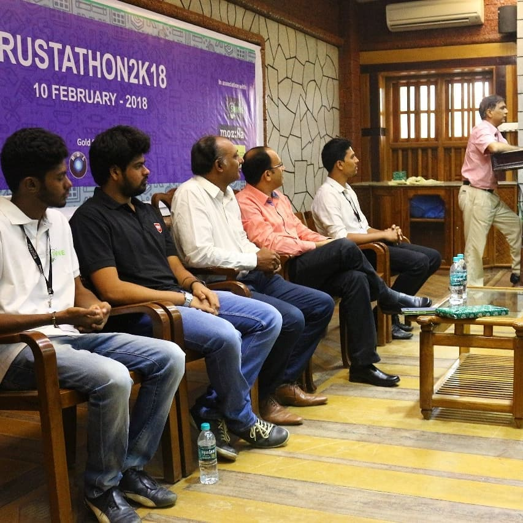

## Rustathon 2K18
Rustathon 2K18 was an event based on RUST programming language organized by Mozilla community in association with Sahyadri hub of Innovation and Entrepreneurship (Now converted to SOSC). This event was a part of the MozActivate campaign of Mozilla.

The Event was held at the Ground floor Seminar Hall, Sahyadri Campus, on the 10th of February, 2018.
upto 10,000$ worth of Amazon Web Service(AWS) credits were sponsored by Amazon Solely for Rust-AWS Projects.
The event was supported by various companies including Hackerearth, The Hindu, New-Age Incubation Network, and AWS Activate.
Various students from different years and branches attended the event which started at 9:00AM

The Speakers of the Event, Krishna Kumar and Mr Jayesh Katta Ramalingaiah, A Mozilla Representative and Full Stack Developer explained to the audience that Rust, being a systems programming language, is important to the future of the web and that it runs blazingly fast, prevents segfaults, and guarantees thread safety. He explained thato wnership is Rust’s most unique feature, and it enables Rust to make memory safety guarantees without needing a garbage collector. Hence, by using Rust, we can make the web better and more secure.
The event ended at around 5:00 PM and event swags were distributed to the participants, courtesy of Mozilla. 

