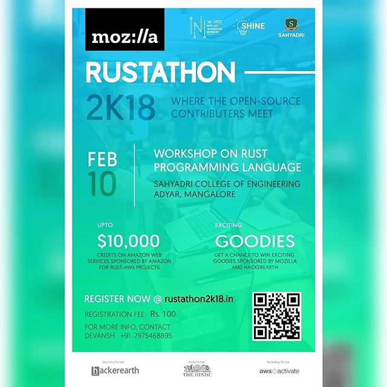

## Event details
Rustathon 2K18 was an event based on RUST programming language organized by Mozilla community in association with Sahyadri hub of Innovation and Entrepreneurship (Now SOSC).This event is a part of the MozActiviate campaign of Mozilla.
Rust is a systems programming language important to the future of the web. It runs blazingly fast, prevents segfaults, and guarantees thread safety. With your help, we want more developers to understand, use and evangelize this language in order to make the web better and more secure. 
The Event was held at the Ground floor Seminar Hall, Sahyadri Campus, on the 10th of February, 2018.
upto 10,000$ worth of Amazon Web Service(AWS) credits were sponsored by Amazon Solely for Rust-AWS Projects.
The event was supported by various companies including Hackerearth, The Hindu, New-Age Incubation Network, and AWS Activate.
Various students from different years and branches attended the event

## Rustathon 2K18

