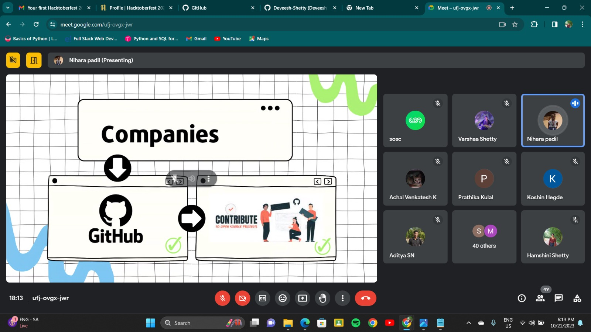
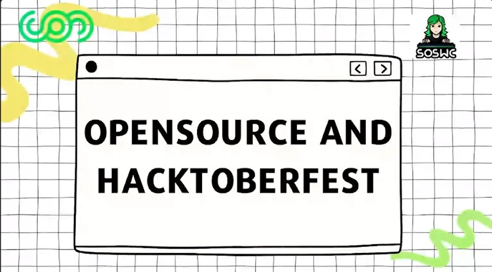

## Introduction

“SOSWC organized a virtual workshop on Open Source and Hacktoberfest” The Sahyadri Open Source Women’s Community (SOSWC) organized a remarkable virtual workshop on Open Source and Hacktoberfest on 21st October, 2023.

## Commencement

SOSWC is a community exclusively by women, for women in technology. The workshop was led by Nihara, SOSWC President and Hamshini, SOSWC Secretary. The event began with a warm welcome from the organizers, emphasizing the importance of open source and Hacktoberfest in the world of technology.

## A segment on Open Source

With a short introduction to SOSWC and what it stands for, Nihara, the SOSWC President, took the stage to provide a comprehensive introduction to open source technology. She highlighted the significance of open source, types of open source with a message to attendees how companies hire based on their contributions to open source. The workshop featured a segment on GitHub, a hub for open source projects. Attendees learned how to harness the powerful features of GitHub, customize their profiles, and contribute effectively to open source repositories.

## A segment on HacktoberFest

Following the wrap-up on the segment on open source, Hamshini, the SOSWC Secretary, delved into the details of Hacktoberfest. With an explanation of the objectives of the event and how participants could contribute to open source projects, the presentation included step-by-step guidance on participating in Hacktoberfest and making meaningful contributions to the open source community. Participants received valuable insights into finding open source projects that align with their interests and skill sets. This session aimed to empower attendees to kickstart their journey in open source development.

## Q/A

The workshop concluded with an engaging question-and-answer session, where attendees had the opportunity to clarify their doubts, seek guidance, and interact with the speakers. Learning resources were also shared with participants to encourage them to delve deeper into the world of open source.

## Closure:

The session came to a close on a high note, with participants having gained a stronghold in their understanding of open source. In its inaugural workshop, SOSWC managed to leave a powerful impact on participants, empowering them to learn, grow and gain exposure to new domains.

### Media

    
 
        
    

    

        
    

